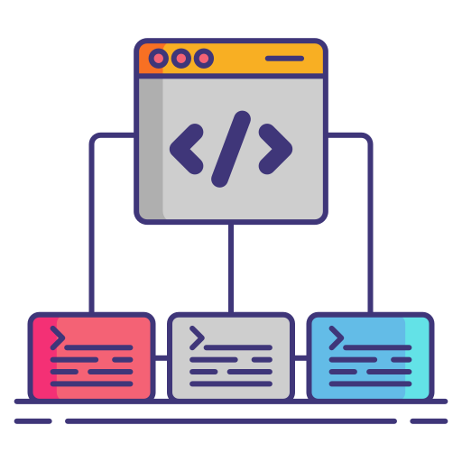

# E Sphere Framework

[](https://opensource.org/licenses/MIT)



[Framework icons created by Flat Icons - Flaticon](https://www.flaticon.com/free-icons/framework)

## Table Of Contents

- [E Sphere Framework](#e-sphere-framework)
  - [Table Of Contents](#table-of-contents)
  - [Description](#description)
    - [Requirements](#requirements)
    - [Build](#build)
    - [Variables](#variables)
    - [Deploy](#deploy)
  - [Changelog](#changelog)
  - [Documentations](#documentations)
  - [Licence](#licence)

## Description

Init files for each Framework.

### Requirements

- Python3
- Git

### Build

Trigger a new build :

```bash
./build.sh
```

You can clean the build folder with this command :

```bash
./clean.sh
```

### Variables

Before deploy the package, you need to update the file **install.json** with your values.

Next copy your files in another folder than **E Sphere Framework** because this folder will be init with git.

### Deploy

```bash
./install.sh
```

## Changelog

See [CHANGELOG](./CHANGELOG.md) for more information.

## Documentations

- [Ideas](./docs/ideas.md)
- [New Framework](./docs/new.md)

## Licence

This project is licensed under the terms of the MIT license.

See [LICENSE](./LICENCE.md) for more information.
